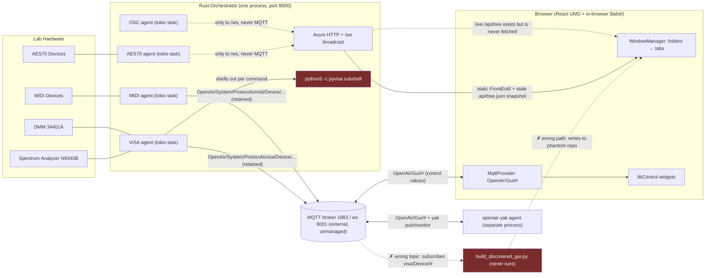
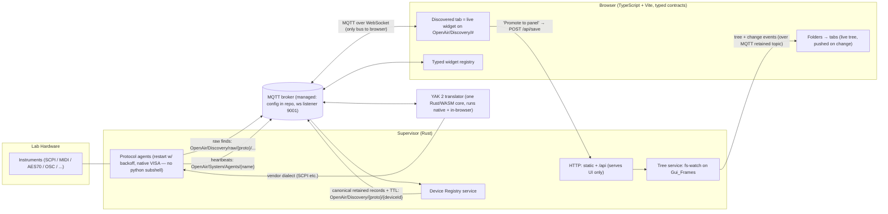
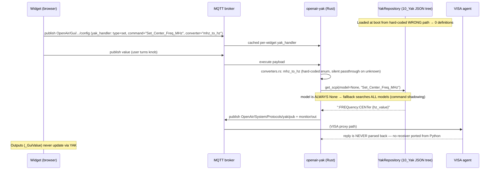
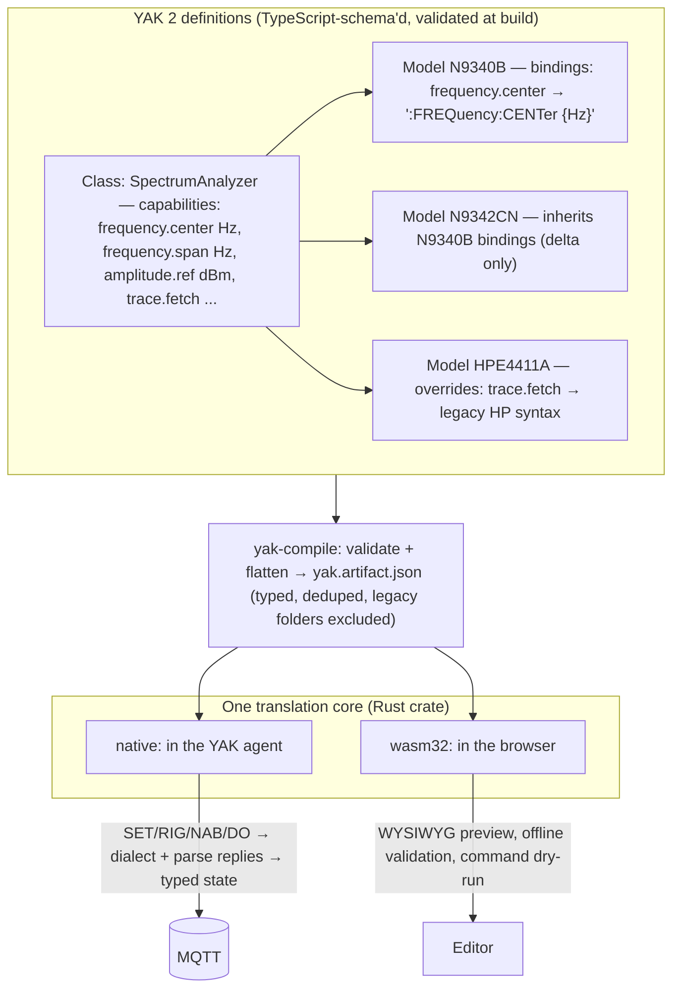
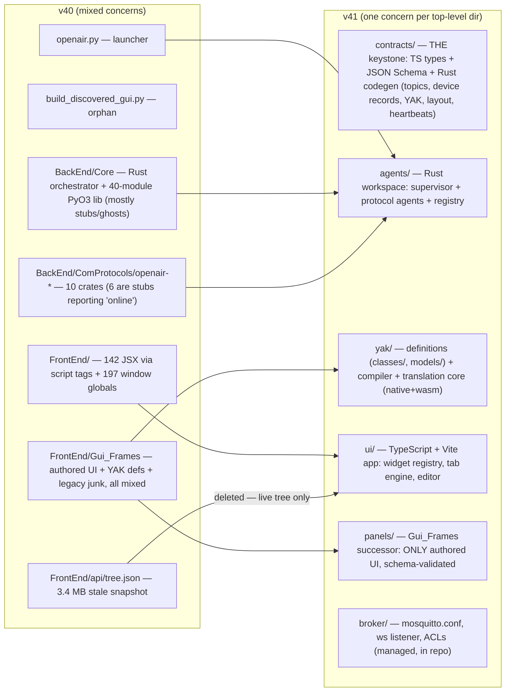
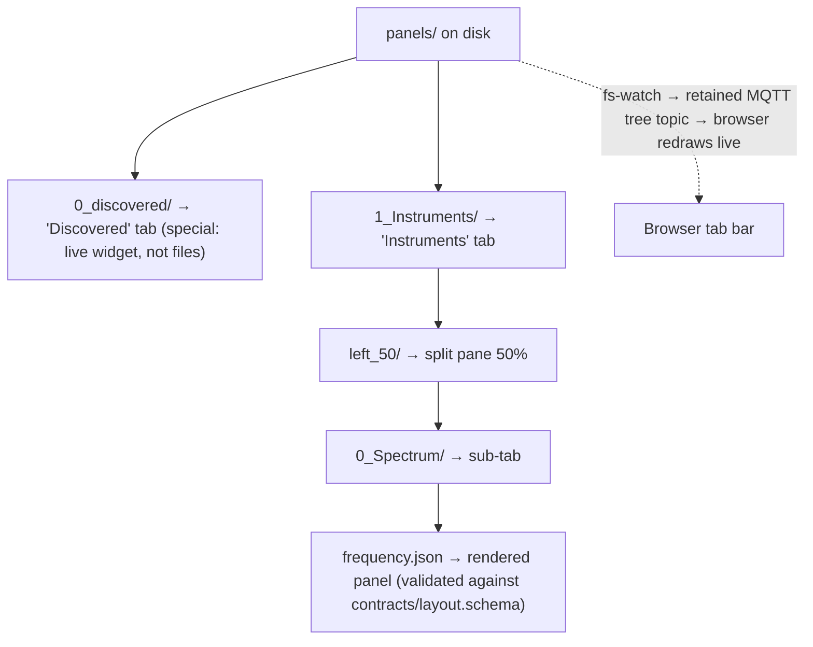
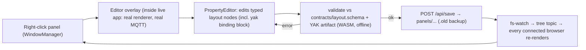
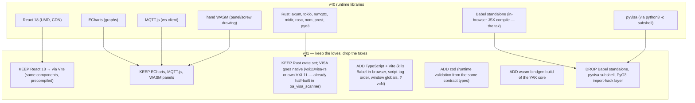

> ## 📌 HISTORICAL SNAPSHOT — 2026-07-17 (v40)
>
> Preserved as written. The "current state" diagrams describe v40. The contract layer, live tree, and agent liveness shown as *target* now exist — see [0_README.md](0_README.md#resolution-status).
> How the system works **today**: [`README.md`](../../README.md), [`contracts/README.md`](../../contracts/README.md), [`BackEnd/ComProtocols/README.md`](../../BackEnd/ComProtocols/README.md).

# OPEN-AIR Architecture Diagrams

*2026-07-17 · Companion to [1_Design_Audit.md](1_Design_Audit.md). Diagrams are Mermaid — GitHub, VS Code, and most viewers render them inline.*

---

## 1. Data transfer — as built today (v40)

Two buses, three topic namespaces, and a discovery pipeline that dead-ends.
Dashed red edges are broken or unwired paths.

Key reading: discovered devices reach the broker and stop. The Discovered tab
is fed by a filesystem-generation pipeline (`BUILDER`) that is broken four
independent ways, and the browser renders a stale tree snapshot regardless.

---

## 2. Data transfer — target (v41)

One bus. One topic grammar. Discovery is live data; folders are authored UI.

---

## 3. YAK translation — as built today

Two sources of truth meet at runtime on a bare string, transmit-only.

## 3b. YAK 2 — target capability model

Class defines the capability **once**; models supply dialect bindings and
overrides. One definition compiles to one validated artifact consumed by the
same translation core everywhere.

The verb grammar (SET/RIG/NAB/DO) survives unchanged — it is the good part.
What changes: commands address a **capability** (`SpectrumAnalyzer.frequency.center`)
instead of a per-model string; the reply path exists (NAB answers parse into
typed state and publish back); and the *same compiled artifact + same core*
runs natively and in the browser via WASM, so the editor can validate and
dry-run a panel with no hardware attached.

---

## 4. File structure — today vs. target

## 4b. Folders-make-tabs (the keeper, made live)

Same mental model as today (`N_` prefixes order, `left_50` splits, JSON files
are panels) — but the browser follows the *live* tree, so dragging a folder in
a file manager redraws the dashboard within a second. That is the README's
promise, actually delivered.

---

## 5. The WYSIWYG loop

Today's loop already has the right shape (edit-in-place, save-to-tree); v41
adds the validation gate — the editor becomes the place where the contracts
are *enforced*, so bad JSON can no longer enter the tree — and the fs-watch
push closes the loop for every connected client, not just the editing one.

---

## 6. Library / dependency map

Nothing the owner loves is lost: the widgets, ECharts, MQTT, React, the WASM
panel art, and the whole folders-make-tabs model all carry forward. What is
dropped is exactly the invisible tax: in-browser compilation, global-variable
wiring, and the Python subshell inside the Rust hot path.
