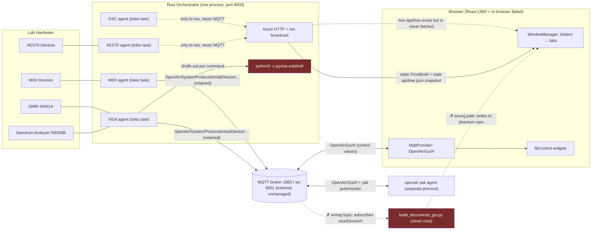
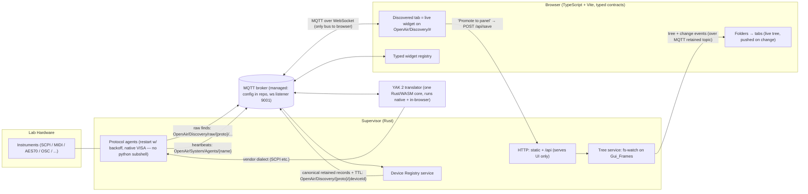
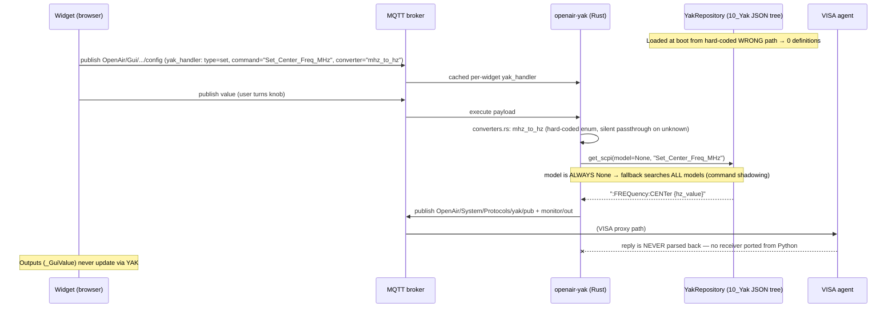
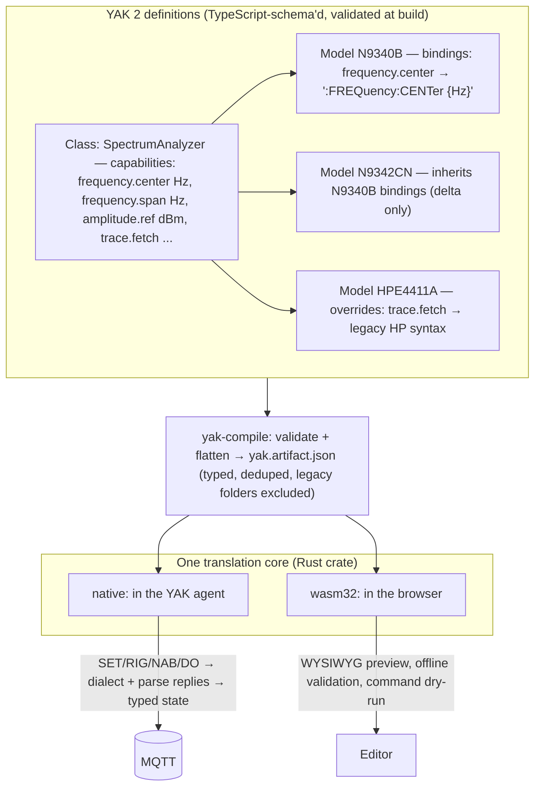
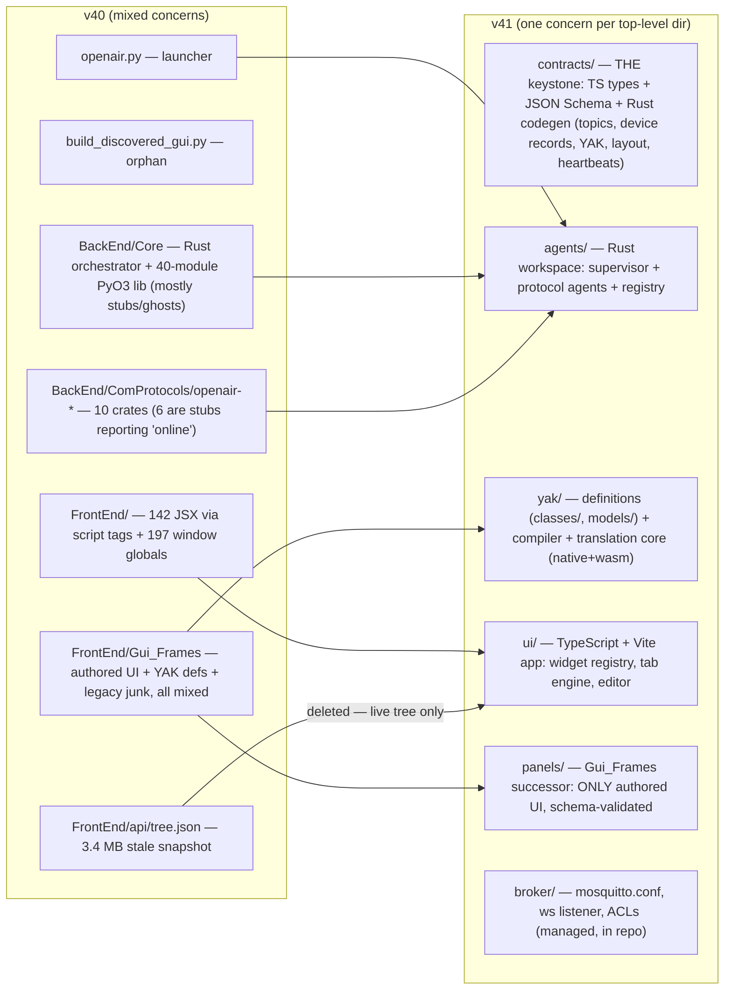
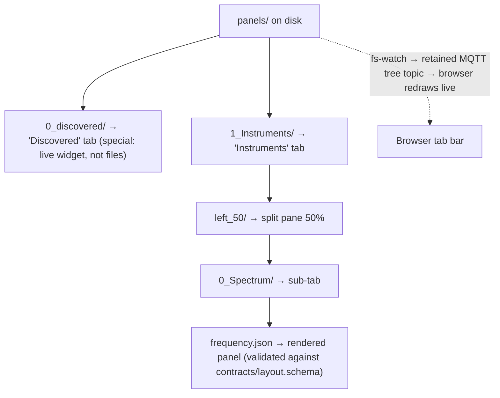
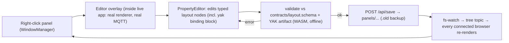
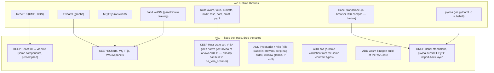
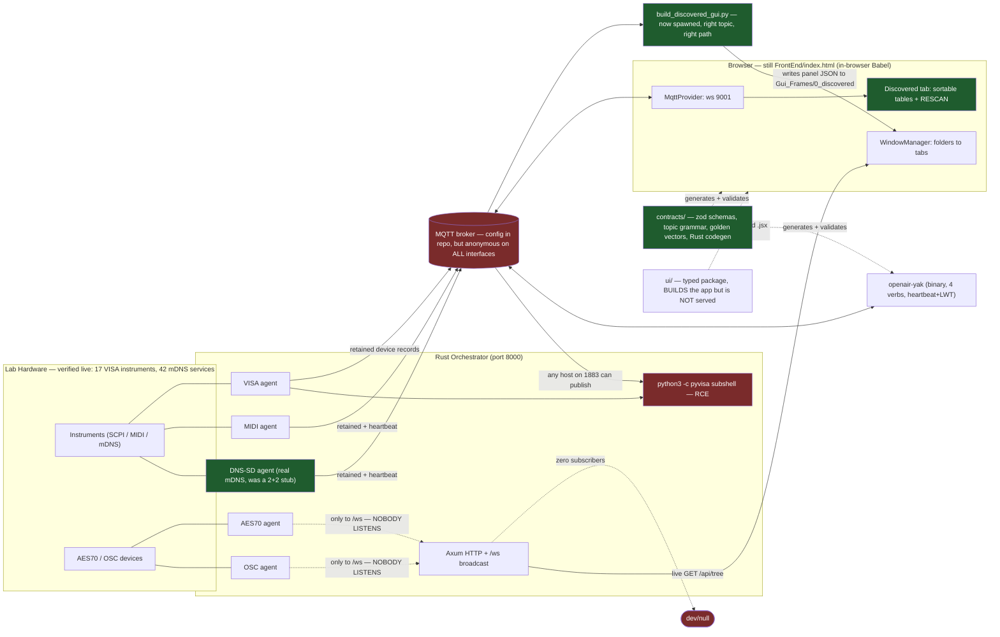

> ## 📌 HISTORICAL SNAPSHOT — 2026-07-17 (v40)
>
> Preserved as written. The "current state" diagrams describe v40. The contract layer, live tree, and agent liveness shown as *target* now exist — see [0_README.md](../Audits/0_README.md#resolution-status).
> How the system works **today**: [`README.md`](../../README.md), [`contracts/README.md`](../../contracts/README.md), [`BackEnd/ComProtocols/README.md`](../../BackEnd/ComProtocols/README.md).
>
> ### ⚠️ §1 and §4 are now materially out of date
>
> Re-verified 2026-07-18 against `964f9d29e`: the discovery pipeline in **§1 has been
> repaired** (the builder runs, on the right topic, to the right path) and the browser
> now fetches the **live** tree. **[§7 — Current state](#7-current-state--2026-07-18)
> is the accurate picture of today**; §1 is kept only as the "before."

# OPEN-AIR Architecture Diagrams

*2026-07-17 · Companion to [1_Design_Audit.md](1_Design_Audit.md). Diagrams are Mermaid — GitHub, VS Code, and most viewers render them inline.*

> **Location note:** this file, [1_Design_Audit.md](1_Design_Audit.md), and
> [yak_protocol_report.md](yak_protocol_report.md) live in `Documents/notes/`;
> the audit index and the plan live in `Documents/Audits/`. Cross-links between
> the two folders broke twice on 2026-07-18 during reorganisation — they are now
> checked on every push by `Deployment/check_doc_links.py`.

---

## 1. Data transfer — as built at v40 *(superseded — see [§7](#7-current-state--2026-07-18))*

Two buses, three topic namespaces, and a discovery pipeline that dead-ends.
Dashed red edges are broken or unwired paths.

> **Superseded 2026-07-18.** Four of the breaks drawn below are fixed: `BUILDER` now
> runs, subscribes to the correct topic, and writes to a derived path, and the browser
> fetches the live `/api/tree`. The `/ws` edges are still accurate — and worse than
> drawn (§7).

Key reading: discovered devices reach the broker and stop. The Discovered tab
is fed by a filesystem-generation pipeline (`BUILDER`) that is broken four
independent ways, and the browser renders a stale tree snapshot regardless.

---

## 2. Data transfer — target (v41)

One bus. One topic grammar. Discovery is live data; folders are authored UI.

---

## 3. YAK translation — as built today

Two sources of truth meet at runtime on a bare string, transmit-only.

## 3b. YAK 2 — target capability model

Class defines the capability **once**; models supply dialect bindings and
overrides. One definition compiles to one validated artifact consumed by the
same translation core everywhere.

The verb grammar (SET/RIG/NAB/DO) survives unchanged — it is the good part.
What changes: commands address a **capability** (`SpectrumAnalyzer.frequency.center`)
instead of a per-model string; the reply path exists (NAB answers parse into
typed state and publish back); and the *same compiled artifact + same core*
runs natively and in the browser via WASM, so the editor can validate and
dry-run a panel with no hardware attached.

---

## 4. File structure — today vs. target

## 4b. Folders-make-tabs (the keeper, made live)

Same mental model as today (`N_` prefixes order, `left_50` splits, JSON files
are panels) — but the browser follows the *live* tree, so dragging a folder in
a file manager redraws the dashboard within a second. That is the README's
promise, actually delivered.

---

## 5. The WYSIWYG loop

Today's loop already has the right shape (edit-in-place, save-to-tree); v41
adds the validation gate — the editor becomes the place where the contracts
are *enforced*, so bad JSON can no longer enter the tree — and the fs-watch
push closes the loop for every connected client, not just the editing one.

---

## 6. Library / dependency map

Nothing the owner loves is lost: the widgets, ECharts, MQTT, React, the WASM
panel art, and the whole folders-make-tabs model all carry forward. What is
dropped is exactly the invisible tax: in-browser compilation, global-variable
wiring, and the Python subshell inside the Rust hot path.

---

# 7. Current state — 2026-07-18

*Added 2026-07-18, verified against the working tree at `964f9d29e`. This supersedes
§1 as the picture of what runs today. Green = repaired since v40. Red = live defect.*

**What the diagram says that the v40 one did not:**

1. **`contracts/` exists and is load-bearing.** The keystone drawn as `B1` in §4's
   target column is real: it generates the Rust the agents compile against and is
   enforced in CI. This was the audit's central recommendation.
2. **The discovery pipeline is repaired but the wrong shape.** `BUILDER` now runs
   correctly — and still routes live data through a filesystem-generation step. The
   §2 target (Discovered tab as a live widget on `OpenAir/Discovery/#`) is unbuilt.
3. **`/ws` is a bus with zero subscribers.** Only two references exist in the whole
   tree: the route at `orchestrator/src/main.rs:420` and a comment in
   `contracts/src/topics/legacy.ts:21`. MIDI and VISA are dual-homed to MQTT and
   survive; **AES70 and OSC are not, so their discoveries reach nothing at all.**
   §1 drew this as "two buses" — it is really one bus and one drain.
4. **The Python subshell is now the top security defect, not just a tax.** The quote
   escaping at `main.rs:552` is bypassable by a trailing backslash, the payload comes
   raw off MQTT, and `broker/mosquitto.conf:20` sets `allow_anonymous true` with no
   `bind_address` → unauthenticated RCE from any host that can reach port 1883.
5. **`ui/` is drawn as a dotted feeder, not a replacement.** It bundles the whole app
   only by side-effect-importing 146 untouched `.jsx` files through `legacy.ts`. Zero
   modules are actually converted, and `FrontEnd/index.html` is still what is served.

## 7b. Distance from here to the §2 target

| Target element (§2) | Status |
|---|---|
| One topic grammar | ✅ Exists and is enforced |
| Agent heartbeats on the bus | ✅ Real, with MQTT Last Will, live-verified |
| Managed broker config in repo | 🔄 Config is in repo — but anonymous and unbound |
| Native VISA, no python subshell | ❌ Phase 4; the *injection* is fixed at Day 14 |
| Discovery as live retained records | ❌ Still filesystem-generated |
| Device Registry + TTL | ❌ Unbuilt |
| Restart with backoff | ❌ Unbuilt — liveness is *detected*, not *acted on* |
| Typed browser (Vite) | 🔄 Builds, not served, 0 modules converted |
| Live tree pushed on change | 🔄 Live fetch works; fs-watch push unbuilt |
| One bus only | ❌ `/ws` survives |

The honest summary: **the specification layer arrived; the runtime topology has not
moved much.** §2 remains the target, unchanged.
