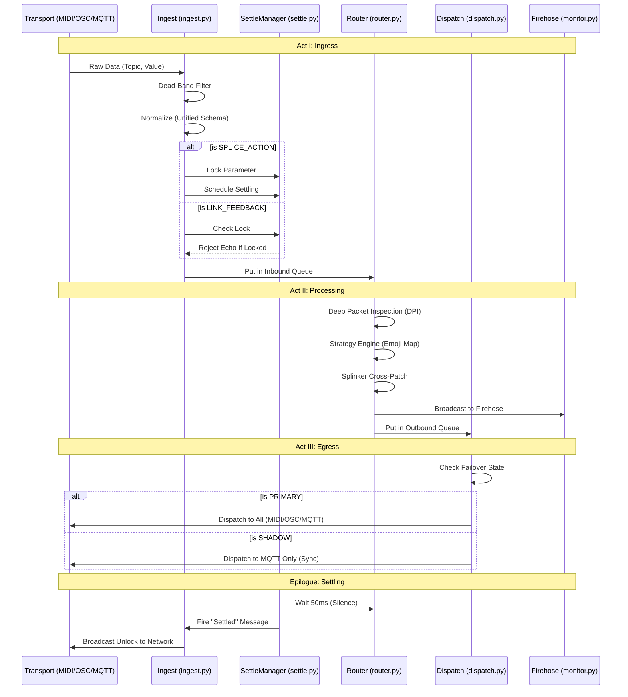

# oaComBroker/Documentation/Event_Playbook.md
#
# A narrative "play-by-play" of the OPEN-AIR Event Lifecycle.
#
# Author: Anthony Peter Kuzub
# Blog: www.Like.audio (Contributor to this project)
#
# Professional services for customizing and tailoring this software to your specific
# application can be negotiated. There is no charge to use, modify, or fork this software.
#
# Build Log: https://like.audio/category/software/spectrum-scanner/
# Source Code: https://github.com/APKaudio/
# Feature Requests can be emailed to i @ like . audio
#
# Version 20260328.1435.1

# 🎭 The Life of a Packet: A Play-by-Play Narrative

In the OPEN-AIR ecosystem, data doesn't just "move"—it is choreographed. This 
document provides a narrative walkthrough of how a single event (like a fader 
movement or a command) journeys through the `oaComBroker`.

## 📊 Visual Lifecycle: The Journey through the Hub

---

## 🎬 Act I: Ingress — The Arrival & Normalization
*Location: `oaComBroker/Core/protocol_router/ingest.py`*

The story begins at a transport boundary. Perhaps a user slides a physical fader 
on a MIDI controller, or a remote server sends an MQTT message.

1.  **📡📥📥 [INGRESS]**: The raw data hits the `ProtocolRouter.ingest()` method. 
    It carries a `transport_source` (e.g., "MIDI"), a `topic` (the address), 
    and a `value`.
2.  **📉🚫📉 [DEAD-BAND]**: The router first checks the **State Cache**. If the 
    incoming value is identical to the last known state (and isn't an event 
    stream like `/Monitor/`), it is dropped immediately. We don't waste CPU on 
    silence.
3.  **🏗️💎🏗️ [NORMALIZATION]**: The raw "noise" is wrapped into the **Unified 
    Message Schema**. A unique `msg_guid` is minted, and logical identity 
    (GUIDs, Partitions) is injected. The message is now "Protocol Agnostic."
4.  **🔒🛡️🔒 [LOCKING]**: If this is a `LINK_FEEDBACK` message (an echo), the 
    **SettleManager** checks if the parameter is currently "locked" by a local 
    user interaction. If locked, the echo is rejected to prevent fader jitter.
5.  **📥📦📥 [QUEUEING]**: The normalized packet is placed into the 
    `inbound_queue`. Act I ends as the transport thread returns to its duties.

---

## ⚙️ Act II: Processing — The Brain at Work
*Location: `oaComBroker/Core/protocol_router/router.py` (`_ingest_loop`)*

In the background, the Ingest Loop picks up the packet. This is the 
"thinking" phase.

6.  **🔍🕵️🔍 [DPI]**: The packet undergoes **Deep Packet Inspection**. If it's 
    an SNMP message, OIDs are resolved. If it's MIDI, clock pulses are separated 
    from control changes. Rich forensic metadata is appended.
7.  **🗺️🧭🗺️ [STRATEGY]**: The **Strategy Engine** looks at the packet's 
    origins and intent. It calculates an **Emoji Strategy String** (e.g., 
    `🚀 💾 Ⓖ`). This tells the system exactly where this packet is allowed 
    to go next.
8.  **🔗🤝🔗 [SPLINKING]**: If the packet matches a "Splink" (a logical cross-
    patch), the **SplinkerManager** intercepts it to trigger a twin event on a 
    different topic.
9.  **🎨🏷️🎨 [TAGGING]**: The packet is tagged with UI-specific metadata. This 
    ensures that when it reaches a dashboard, the browser knows exactly how 
    to render it (colors, icons, visibility).
10. **📡📤📤 [FIREHOSE]**: The packet is broadcast to the **Firehose**—a real-
    time telemetry stream used for monitoring and debugging. Act II ends as 
    the packet is dropped into the `outbound_queue`.

---

## 🚀 Act III: Egress — The Final Dispatch
*Location: `oaComBroker/Core/protocol_router/dispatch.py`*

A pool of dedicated worker threads handles the final delivery.

11. **⚖️🔄⚖️ [FAILOVER]**: The router checks its **Failover State**.
    - If **PRIMARY**: All transports (MQTT, OSC, MIDI, SNMP) are active.
    - If **SHADOW**: Only MQTT (state sync) is active. Hardware-facing 
      transports are muted to prevent physical collisions.
12. **🔀🎯🔀 [TARGETING]**: The worker reads the Emoji Strategy.
    - `🚀` or `Ⓜ️`? Route to **MQTT**.
    - `🅾️`? Route to **OSC**.
    - `🎹`? Route to **MIDI**.
13. **🛡️🔌🛡️ [GUARDS]**: Each dispatch is wrapped in a **@protocol_guard**. 
    If the network cable is unplugged or the transport crashes, the error is 
    isolated. The rest of the router stays alive.
14. **📡📤📤 [OUTBOUND]**: The manager (e.g., `MqttConnectionManager`) takes 
    the payload, serializes it (often as JSON), and flings it across the 
    wire/cable.

---

## 🏁 Epilogue: Settling
*Location: `oaComBroker/Core/protocol_router/settle.py`*

The journey doesn't end with delivery.

15. **⏲️✅⏲️ [SETTLING]**: 50ms after the last `SPLICE_ACTION`, the 
    **SettleManager** fires a final "Settled" message. This unlocks the 
    parameter and confirms to the entire network that the interaction is 
    complete. The system returns to a state of rest, waiting for the next spark 
    of data.
