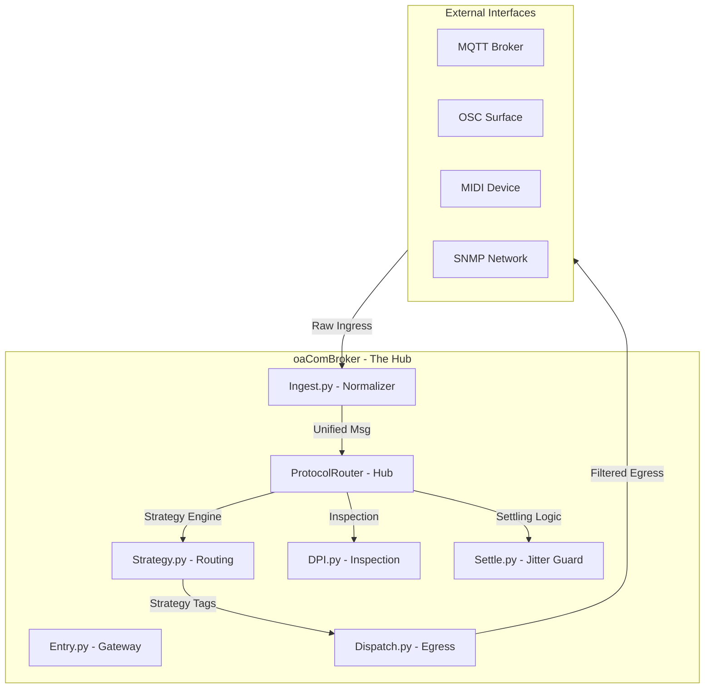

# oaComBroker/Documentation/README.md
#
# Primary technical documentation for the Communication Broker module.
#
# Author: Anthony Peter Kuzub
# Blog: www.Like.audio (Contributor to this project)
#
# Professional services for customizing and tailoring this software to your specific
# application can be negotiated. There is no charge to use, modify, or fork this software.
#
# Build Log: https://like.audio/category/software/spectrum-scanner/
# Source Code: https://github.com/APKaudio/
# Feature Requests can be emailed to i @ like . audio
#
# Version 20260328.1505.1

# 📡 oaComBroker: Communication Broker & Protocol Router

## 📖 Overview
The `oaComBroker` package is the central nervous system of the OPEN-AIR 
architecture. It serves as the sole orchestrator for communication, bridging 
hardware-facing partition logic with high-level network traffic. 

At its heart is the **Protocol Router**, a highly modular, thread-safe, and 
deeply inspected routing engine that standardizes all incoming network traffic 
(MQTT, OSC, MIDI, SNMP) into a single "Unified Message Schema."

---

## 🏗️ System Architecture: The Nerve Center

---

## 🏗️ Core Components

### 1. The Gateway (`Entry.py`)
Following the **Partitioned Architecture**, `Entry.py` is the only file in the 
module root. It acts as the public API for the broker, providing methods to 
start core services and access the Singleton router instance.

### 2. The Protocol Router (`Core/protocol_router/router.py`)
A singleton hub that manages inbound and outbound queues. It handles the 
lifecycle of worker threads and manages the failover state (Active/Shadow) to 
prevent hardware collisions.

### 3. Unified Ingestion (`Core/protocol_router/ingest.py`)
Normalizes all raw transport data (e.g., MIDI bytes, OSC bundles) into a unified 
dictionary format containing:
* `ts`: High-precision timestamp.
* `logical_source`: The protocol origin (MQTT, GUI, etc.).
* `msg_guid`: Unique identifier for tracking a packet through its lifecycle.
* `msg_type`: Categorizes the message (SPLICE_ACTION, LINK_FEEDBACK).

---

## 🧠 Data Pipeline Flow
For a narrative "play-by-play" of how events flow through the system, see the 
[Event Playbook](./Event_Playbook.md).

1. **Ingest**: Normalize raw data and apply dead-band filtering.
2. **DPI**: Perform Deep Packet Inspection for metadata enrichment.
3. **Strategy**: Apply an emoji-based routing strategy to determine destinations.
4. **Settle**: Manage interaction locks to prevent feedback jitter.
5. **Dispatch**: Route to transport managers for final transmission.

---

## 🔬 Forensics & Monitoring
The router maintains a 2000-packet rolling buffer (the Firehose) and provides 
forensic APIs for:
* **`get_dpi_report(ts)`**: Detailed analysis of a specific packet.
* **`get_splink_relationship(ts)`**: Correlation between patched parameters.

---

## 🛠️ Configuration & Dependencies
* **Partitioned Architecture**: Strictly separates transport logic from business 
  rules.
* **Concurrency**: Uses a `ThreadPoolExecutor` for non-blocking dispatch.
* **Dependencies**: Relies on `oaLogging` for forensic tracing and 
  `oaOchestration` for protocol safety guards.
