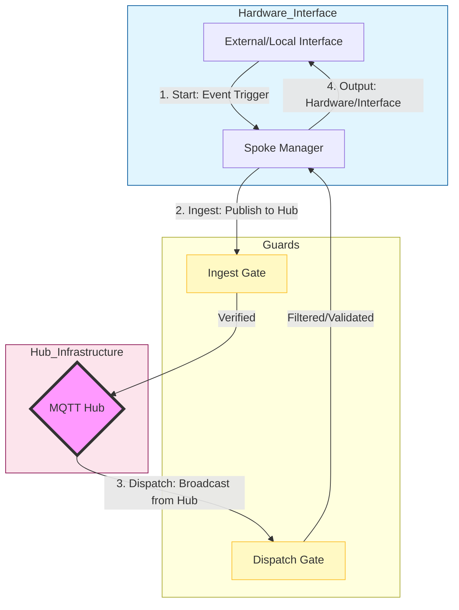
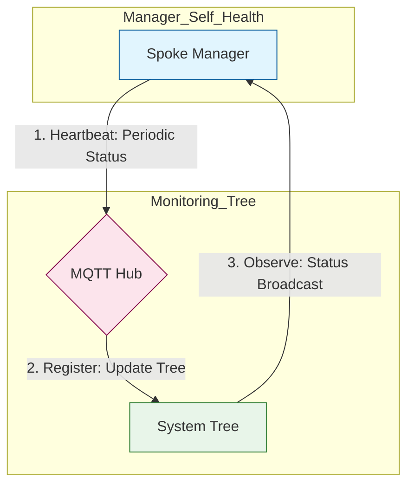

# Protocol Stateflow (Hub-and-Spoke Model)

## Hub-and-Spoke Architecture
The system operates as a centralized Hub (MQTT Storage) with spoke protocols (this module).

### Data Flow & Routing Diagram

## Lifecycle & Logic
1. **Start**: The manager initializes as a Spoke, registering with the `ProtocolRouter` Hub.
2. **Ingest (Spoke -> Hub)**:
   - Event triggered (MIDI note, OSC addr, etc).
   - **Ingest Gate**: Router checks `ingest_enabled` for this Spoke.
   - **Hub**: Data is validated and committed to `MQTT Storage`.
3. **Dispatch (Hub -> Spoke)**:
   - MQTT Hub broadcasts state changes to all connected Spokes.
   - **Dispatch Gate**: Router checks `egress_enabled` for this protocol.
   - **Filter**: Echo removal (origin-source guard) ensures no self-reflection.
4. **Transmit**: Validated data is rendered to the local physical interface (MIDI Out, OSC Out, etc).

## System Tree Reporting (Heartbeats & Status)
All protocol managers are required to report their operational status to the central monitoring hierarchy. This ensures the Hub maintains an accurate, real-time view of system health and failover eligibility.

### Reporting Flow

### Reporting Lifecycle
1. **Heartbeat**: Every manager periodically publishes its status (e.g., ) to the Hub.
2. **System Tree Registration**: The Hub (MQTT) updates the global  tree.
3. **Observation**: Managers subscribe to their own status tree to maintain a synchronized, failover-aware state.

## System Tree Reporting (Heartbeats & Status)
All protocol managers report their operational status to the central monitoring hierarchy.

### Reporting Flow

### Reporting Lifecycle
1. **Heartbeat**: Every manager periodically publishes its status (e.g., OPEN-AIR/System/Status/Protocol/Bridge) to the Hub.
2. **System Tree Registration**: The Hub (MQTT) updates the global System/Status tree.
3. **Observation**: Managers subscribe to their own status tree to maintain a synchronized, failover-aware state.
