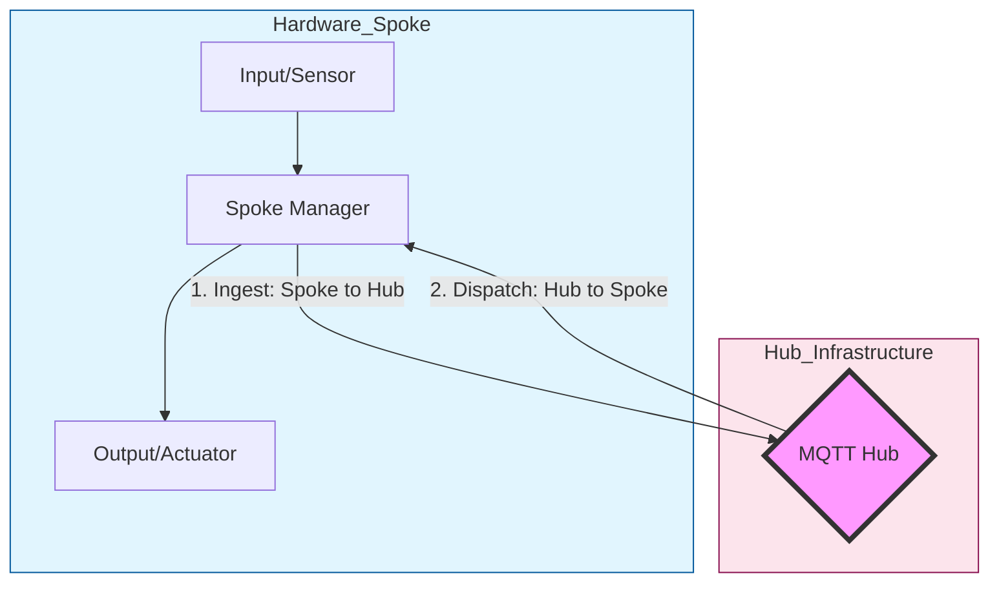

# Protocol Stateflow (Hub-and-Spoke Model)

## Hub-and-Spoke Architecture
The system operates as a centralized Hub (MQTT Storage) with spoke protocols (this module).

### Data Flow Diagram

## Flow Logic
1. **Ingest (Spoke -> Hub)**:
   - Data enters via the Spoke Manager (this protocol).
   - **Guard**: The Protocol Router checks `ingest_enabled` for this protocol.
   - **Hub**: Data is persisted into the MQTT Storage.

2. **Dispatch (Hub -> Spoke)**:
   - MQTT Hub broadcasts state changes.
   - **Guard**: The Protocol Router checks `egress_enabled` for this protocol.
   - **Output**: The Spoke Manager processes the message (e.g., OSC send, MIDI out).
