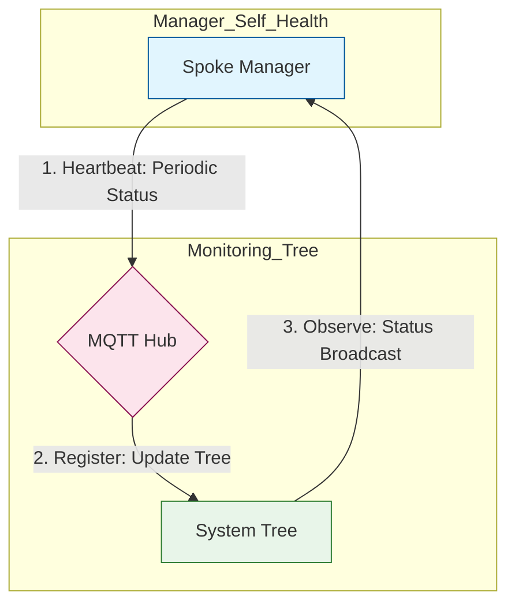

# oaComWebsocket Protocol Shifter Documentation

## 1. Incoming Message (Hardware/Spoke)
*   **Format**: Raw data packet from the transport (e.g., MIDI Bytes, OSC UDP datagram).
*   **Action**: Ingested by the Spoke Manager, normalized into the internal Unified Message Schema.
*   **Metadata**: Identity (GUID), timestamp, and transport-specific parameters are extracted.

## 2. MQTT Published Message (Hub Ingress)
*   **Format**: Standardized JSON payload pushed to the Hub.
*   **Example**:
    ```json
    {
      "val": 127,
      "source": "oaComWebsocket",
      "ts": 1775681977.47,
      "meta": { "msg_type": "SPLICE_ACTION", "origin_source": "oaComWebsocket" }
    }
    ```

## 3. MQTT Received Message (Hub Egress)
*   **Format**: Broadcasted JSON payload received from the Hub (MQTT).
*   **Action**: The Spoke Manager performs an `origin_source` check to prevent reflection loops (ignores if `origin_source == "oaComWebsocket"`).
*   **Filtering**: `is_settled` or reflection logic applied.

## 4. Transmitted Message (Outbound Hardware)
*   **Format**: Transport-native data (e.g., binary SysEx, OSC address string).
*   **Action**: Final payload is mapped from the MQTT topic to the protocol address and emitted to physical hardware.

## Data Movement Pipeline
1.  **Creation**: Triggered by hardware event -> Spoke Manager.
2.  **Ingestion**: Spoke Manager -> Router (Ingest Gate) -> MQTT Hub.
3.  **Passing**: Hub -> Router (Dispatch Gate) -> Spoke Manager.
4.  **Movement**: Spoke Manager -> Physical Transport (TX).

## System Tree Reporting (Heartbeats & Status)
All protocol managers report their operational status to the central monitoring hierarchy to maintain system-wide state consistency.

### Reporting Flow


### Status Reporting Lifecycle
1. **Heartbeat**: Every manager periodically publishes its status (e.g., `OPEN-AIR/System/Status/[Protocol]/Bridge`) to the Hub.
2. **System Tree Registration**: The Hub (MQTT) updates the global `System/Status` monitoring tree.
3. **Observation**: Managers subscribe to their own status tree to maintain a synchronized, failover-aware state.
